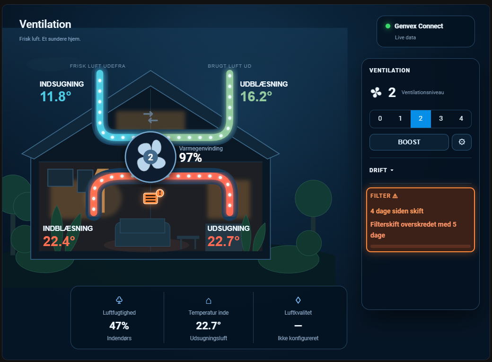

# Ventilation Flow Card

[](https://github.com/MEbsen/GenvexFlowCard/actions/workflows/validate.yml)
[](https://hacs.xyz/docs/faq/custom_repositories/)
[](https://www.home-assistant.io/)
[](LICENSE)
[](https://buymeacoffee.com/mebsen)

A responsive, animated Home Assistant dashboard card for heat-recovery ventilation systems. Ventilation Flow Card turns ventilation entities into a visual representation of the house, airflow, temperatures, heat recovery and the controls supported by the selected system.

The card started as Genvex Flow Card and has evolved into a provider-based card. Existing Genvex configurations remain compatible.

> **Unofficial project:** Ventilation Flow Card is an independent community project. It is not affiliated with, endorsed by, or sponsored by Genvex, Danfoss or other ventilation manufacturers.

## Preview



*Genvex Connect shown. The controls and status information displayed by the card depend on the capabilities exposed by the selected Home Assistant integration.*

## Highlights

- Animated four-way airflow visualization.
- Temperature-driven airflow colours.
- Heat-recovery efficiency display.
- Fan speed visualization and control where supported.
- Fan RPM display and RPM-driven animation where available.
- Boost control with speed/duration settings when exposed by the provider.
- Bypass status and control where supported.
- Filter status, warning and reset handling.
- Humidity and operating-status information.
- Provider-based architecture for multiple ventilation integrations.
- Visual Home Assistant card editor.
- Responsive SVG layout.
- Existing `custom:genvex-flow-card` configurations remain supported.

## Supported providers

| Provider | Status | Fan control | Boost | Bypass | Filter | RPM |
| --- | --- | --- | --- | --- | --- | --- |
| Genvex Connect | Supported | Steps | Yes | When exposed | Days / calculated fallback | When exposed |
| Danfoss Air | Supported | 0–100% | Yes | Yes | Remaining % | Supply / exhaust |

Support depends on the entities and capabilities exposed by the Home Assistant integration and the ventilation unit itself.

The provider architecture is designed so additional systems can be added by mapping their Home Assistant entities and capabilities rather than implementing a separate card UI.

## Requirements

- Home Assistant with a supported ventilation integration.
- At least one supported provider available in Home Assistant.
- JavaScript modules enabled for Lovelace resources.

Ventilation Flow Card communicates only with Home Assistant. It does not connect directly to the physical ventilation unit.

## Installation with HACS

[](https://my.home-assistant.io/redirect/hacs_repository/?owner=MEbsen&repository=GenvexFlowCard&category=plugin)

Use the button above for one-click setup, or add it manually:

1. Open **HACS → Frontend**.
2. Open the menu and choose **Custom repositories**.
3. Add `https://github.com/MEbsen/GenvexFlowCard`.
4. Select category **Dashboard** and add the repository.
5. Install **Ventilation Flow Card**.
6. Reload Home Assistant in the browser.

HACS normally creates the Lovelace resource automatically. If it does not, add:

```text
/hacsfiles/GenvexFlowCard/genvex-flow-card.js
```

Resource type: **JavaScript module**.

## Card configuration

Add **Custom: Ventilation Flow Card** from Home Assistant's card picker and select the integration/provider in the visual editor.

### YAML example

```yaml
type: custom:genvex-flow-card
title: Ventilation
height: 720
provider: genvex_connect
```

The historical card type `custom:genvex-flow-card` is intentionally retained for backwards compatibility.

| Option | Type | Default | Description |
| --- | --- | --- | --- |
| `type` | string | required | Must remain `custom:genvex-flow-card`. |
| `provider` | string | `genvex_connect` | Ventilation provider. Currently `genvex_connect` or `danfoss_air`. |
| `ventilation_entity` | string | auto / optional | Entity used to anchor provider discovery when applicable. |
| `genvex_entity` | string | legacy / optional | Existing Genvex configurations remain supported. |
| `filter_interval_days` | number | `-1` | `-1` or empty uses the interval reported by Genvex Connect. A positive value overrides the integration. |
| `title` | string | `Ventilation` | Card title. |
| `height` | number | `720` | Rendered card height in pixels. |

## How providers work

A provider maps the entities exposed by a Home Assistant ventilation integration to common card capabilities such as:

- outside, supply, extract and exhaust temperatures;
- fan status and fan control;
- supply and exhaust RPM;
- boost and optional boost settings;
- bypass;
- filter state;
- humidity, defrost, heating and other operating states.

The card renders controls from those capabilities. A provider therefore does not need its own separate visual design.

This architecture also allows systems to expose only the features they actually support: unavailable capabilities are omitted rather than simulated.

## Genvex Connect

Genvex Connect remains fully backwards compatible with the original Genvex Flow Card.

The card can use the integration's fan level, temperatures, operating states, boost, fan RPM and filter entities. Filter warnings use `filter_days_left` directly when available. With `filter_interval_days: -1` (the default), the service interval is read from Genvex Connect in days or months; a positive configured value overrides the integration.

On CTS400 systems running Genvex Connect 1.5.4 or newer, the card exposes the available humidity threshold, low/high humidity fan levels and high-humidity timeout behind a compact **Fugtstyring** settings button. The button is omitted on systems that do not expose these capabilities.

## Danfoss Air

Danfoss Air support includes automatic entity discovery for the supported Home Assistant entities, percentage fan control, AUTO/OFF operation, Boost, writable bypass, remaining-filter percentage and supply/exhaust RPM when those entities are exposed.

The exact feature set can vary with the unit and Home Assistant integration.

## Troubleshooting

### The card is not listed

- Confirm that the repository was added to HACS as category **Dashboard**.
- Confirm that `genvex-flow-card.js` exists as a JavaScript module resource.
- Reload the browser without cache after installing or updating.

### The old version is still shown

1. Select **Redownload** on the Ventilation Flow Card page in HACS.
2. Reload Home Assistant without browser cache.
3. Check the version written to the browser console by Ventilation Flow Card.

### A control or value is missing

The card only shows capabilities it can resolve from the selected provider. Confirm that the relevant entity exists, is enabled and is available in Home Assistant.

When reporting a provider mapping problem, include the card version and the relevant entity IDs/states.

## Development

Stable code lives on `main`; active development lives on `dev`.

The distributed HACS resource is a single standalone JavaScript file, while provider implementations are maintained as modules under `src/providers/`.

```bash
npm install
npm run check
```

The check command builds the standalone bundle and runs the smoke tests.

### Automated releases

Development prereleases are created automatically from `dev`. Stable releases are created from `main`: finish and validate all changes, update `CARD_VERSION` in `src/ventilation-flow-card.js`, and make the final version commit with the exact message `Release vX.Y.Z`.

GitHub Actions then builds and smoke-tests the standalone card, validates HACS compatibility, creates the matching tag and publishes both `genvex-flow-card.js` and `genvex-flow-card.zip`. Existing tags are never overwritten.

Pull requests, provider contributions and reproducible bug reports are welcome.

## Roadmap

- Add more ventilation providers using the common capability model.
- Continue moving provider-specific presentation logic into capability-based rendering.
- Expand provider/device test coverage.
- Improve automatic entity discovery where integrations expose multiple ventilation devices.
- Add additional screenshots as provider implementations are validated.

## Support

If Ventilation Flow Card is useful to you, you can support its continued development by [buying me a coffee](https://buymeacoffee.com/mebsen).

Contributions are entirely optional; the card remains free and open source.

## Trademark notice

Ventilation Flow Card is an independent, unofficial open-source project and is not affiliated with, endorsed by, or sponsored by Genvex, Danfoss or other ventilation manufacturers. Product and company names are trademarks of their respective owners and are used only to describe compatibility.

## License

[MIT](LICENSE)
